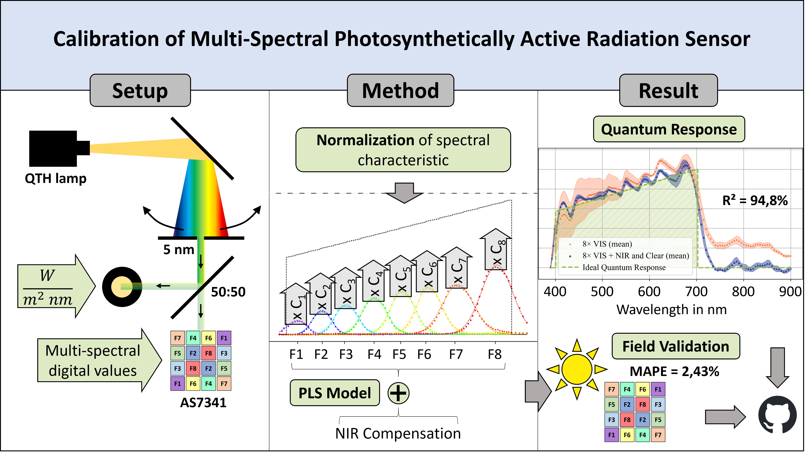

# Calibration of Multi-Spectral Sensor

[](https://doi.org/10.5281/zenodo.15090040) 

## Overview

This repository contains the code, data, and results for the publication:  
**"Calibration of Multi-Spectral Photosynthetically Active Radiation Sensor"**  
Authors: Johannes Klueppel (1), Megan Jurzcak (1), Ulrike Wallrabe (1), Laura Maria Comella ^2^   
(1) _Department of Microsystems Engineering – IMTEK, University of Freiburg, Freiburg, Germany_  
(2) _Institute of Energy Efficient Mobility, Karlsruhe University of Applied Sciences, Karlsruhe, Germany_  

Published in: Elsevier Measurement (2026)  
DOI: [https://doi.org/10.1016/j.measurement.2026.120734](https://doi.org/10.1016/j.measurement.2026.120734) 
##


## Project Description
Photosynthetically Active Radiation (PAR) sensors are essential tools in plant stress monitoring, ecophysiology, and forest growth modeling. Recently, multi-spectral PAR sensors have emerged as promising alternatives to conventional single-channel systems, offering comparable accuracy and additional spectral information.  
However, existing calibration methods rely on single-channel references under variable ambient light conditions, which limits their reliability across diverse lighting environments. This study introduces a novel calibration methodology conducted in a controlled light environment to ensure consistent, reproducible calibration independent of external light variability. The Partial Least Squares (PLS) regression model was tailored for this application by integrating the optical properties of the system components through a customized preprocessing framework. PLS effectively manages collinearity among spectral channels, generating individual calibration coefficients while compensating for spectral leakage, particularly in the near-infrared range. The proposed calibration approach is validated through field experiments under varying weather conditions, demonstrating a normalized RMSE of just 3.92% compared to a commercial PAR sensor. 

## Repository Structure

├── data/ # Raw and processed data sets  
├── src/ # Source code for analysis  
├── supplementary_material/ # Additional documentation of the AS7341 characteristic  
├── LICENSE # License for project  
└── README.md # Project overview

## Installation

To reproduce the analysis, clone this repository and install the required dependencies:

```bash
git clone https://github.com/yourusername/Multi-Spectral-PAR-Sensor.git
cd PATH/your-repo-name/src
pip install -r requirements.txt
```
Consider to use an own environment.

## Usage

1. **Prepare the Data**:
   - Use the raw measurement data in the `/data` directory or place there your input data files. Ensure the data format matches the requirements of the library.

2. **Run the Notebook**:
   - Open `Calibration_Execution.ipynb` in Jupyter Notebook or Visual Studio Code.
   - Follow the steps in the notebook to load the data, apply the calibration functions from `Calibration.py`, and view the results.

3. **Output**:
   - The results of the calibration will be displayed in the notebook and saved to an output file in the `/data` directory.


## Citation of Publication
If you use this project, please cite our publication:

```
@article{klueppel_calibration_2026,
	title = {Calibration of multi-spectral photosynthetically active radiation sensor},
	volume = {270},
	issn = {02632241},
	doi = {10.1016/j.measurement.2026.120734},
	urldate = {2026-02-19},
	journal = {Measurement},
	author = {Klueppel, Johannes and Jurczak, Megan and Wallrabe, Ulrike and Comella, Laura Maria},
	month = apr,
	year = {2026},
	pages = {120734},
}
```

## Zenodo
[](https://doi.org/10.5281/zenodo.15090040) 

## Acknowledgements
This work was conducted within the framework of the collaborative research center ECOSENSE, with funding from the Deutsche Forschungsgemeinschaft (DFG) - Project-ID 459819582 - SFB 1537.  
Further information: [ECOSENSE website](https://uni-freiburg.de/ecosense/)  
DOI to [ECOSENSE Grand Proposal](https://doi.org/10.3897/rio.10.e129357)
