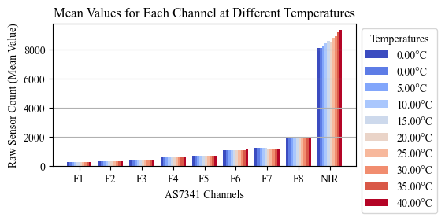
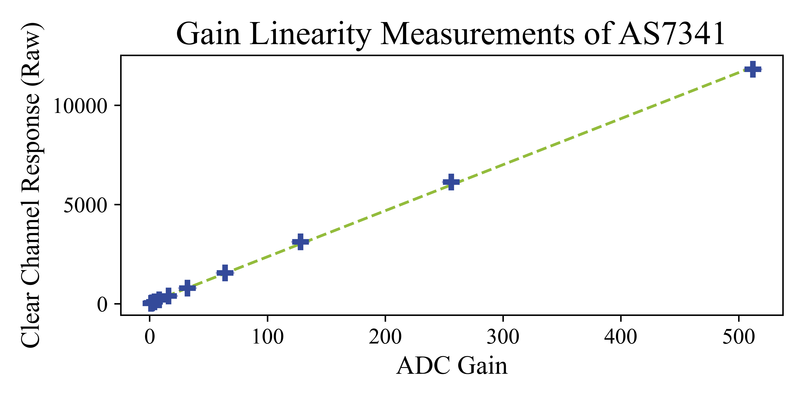
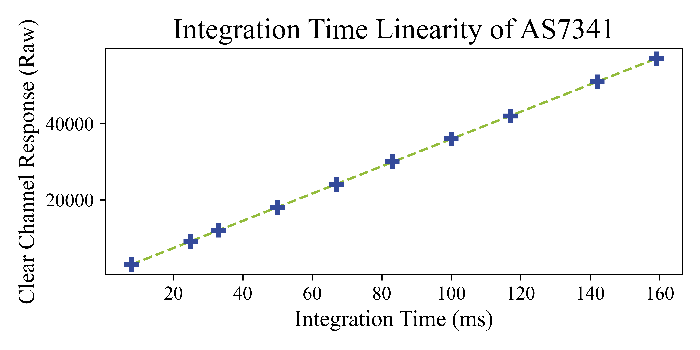
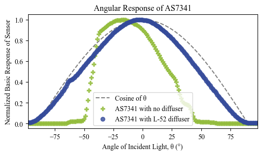

# Supplementray Material: AS7341 Multi-Spectral Sensor Characteristics
## Dark Current and Temperature Stability
Photodiodes usually show temperature dependent effects.
According to the AS7341 specifications, the integrated dark photodiode works alongside the embedded autozeroing function to mitigate these effects.
To be sure, we investigated the true performance of the AS7341 in a dark environment and at various temperatures.
To simulate a realistic range of operating temperatures, the sensor was enclosed within a temperature chamber and illuminated with broadband light from an incandescent bulb. 
The temperature was adjusted from $0~\text{°C}$ to $40~\text{°C}$, with fifty sensor readings documented at each distinct temperature level. 

In a dark environment, the influence of errant signals which do not originate from incident photons is due to the autozeroing function negligible. 
For different temperature levels, across the average of all visible channels, the coefficient of variation (CV) between unprocessed sensor output and temperature was calculated to be $1.65~\%$. While the values for visible channels remained relatively steady, a significant shift in sensitivity was noted in the NIR channel as the temperature fluctuated. This outcome was anticipated, given that thermal radiation encompasses emissions in the NIR spectrum. This section demonstrates that the AS7341's autozero function operates reliably, necessitating no additional correction.

## Measurement Linearity
To cover a wide range of irradiance levels, the AS7341 sensor allows for the configuration of two parameters when performing measurements. The first parameter is the gain factor, and the second is the integration time (TINT). Once a measurement is taken, the raw value for each channel $i$ must be transformed into a dimensionless basic parameter:
$$
    \text{basic}_i = \frac{\text{raw}_i}{\text{Gain} \times \text{TINT}}
$$
To assess the linearity of sensor responses with different gain and integration times, experiments were performed. During these linearity assessments, the monochromator was excluded so that the sensors were exposed to broad-spectrum light. The lamp's intensity was fixed. Initial measurements included all possible ADC gain settings with a fixed integration time of 50~ms. Subsequent measurements were executed with a steady gain of 512× and 14 varying integration times ranging from 8~ms to 180~ms. 
The outcomes of the gain linearity tests are depicted in the following figures. These figures present data exclusively for the clear channel, the results were analogous on all observed channels.

## Angular Response
The ideal response of a photodiode when exposed to light with different incident angles follows Lambert’s cosine law. 
This law dictates that the intensity of radiation observed is directly proportional to the cosine of the angle formed by the surface normal and the direction of observation.
Due to the array arrangement of the photodiodes, the channels are not equally responsive to different incident light angles.
In order to measure the sensor’s performance at a variety of angles, the AS7341 devices to be tested were mounted atop an angular stage. 
Broad spectrum light then illuminated the sensor as it was rotated through angles from -90° to 90° for several repetitions. 
Experiments were executed first without any diffuser (green line) and afterwards with an OptSaver L-52 (Kimoto LTD, Cedartown, GA, USA) diffuser suspended above the photodiode. 
The measured response of channel F4 with diffuser is shown in blue. 

It should be noted that analogous behaviour was observed on all channels. 
Through this measurement it was demonstrated that inclusion of the diffuser made the sensor response significantly more adherent to the ideal cosine response. 
